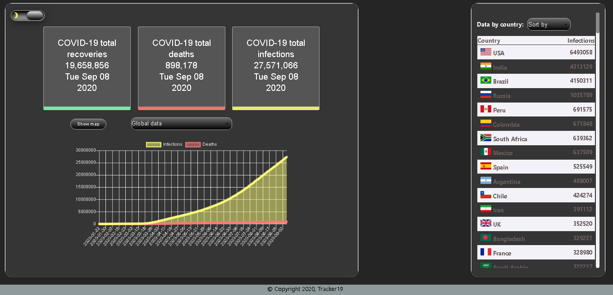
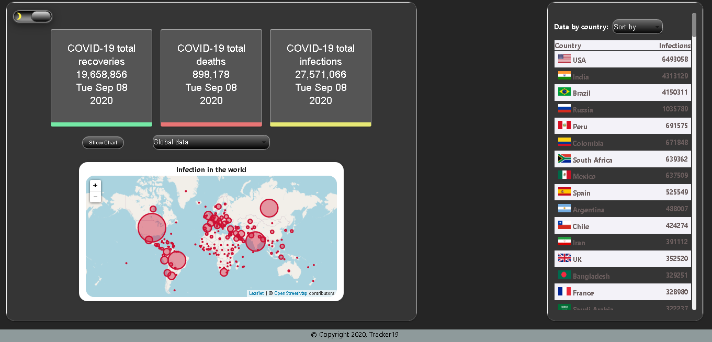
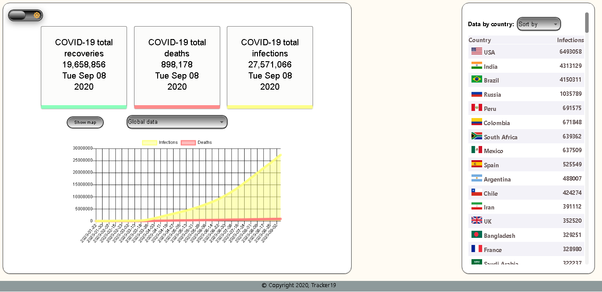

# Covid19 tracker app

This project was bootstrapped with [Create React App](https://github.com/facebook/create-react-app).

## Running locally

1. Clone this repo
1. `cd covid19-tracker`
1. `npm i`
1. `npm start`

## Deployment
1. Netlify
1. URL: https://trackvid19.netlify.app

## Demo

  

  

  

## API

* https://disease.sh/v3/covid-19/countries
* https://covid19.mathdro.id/api/
